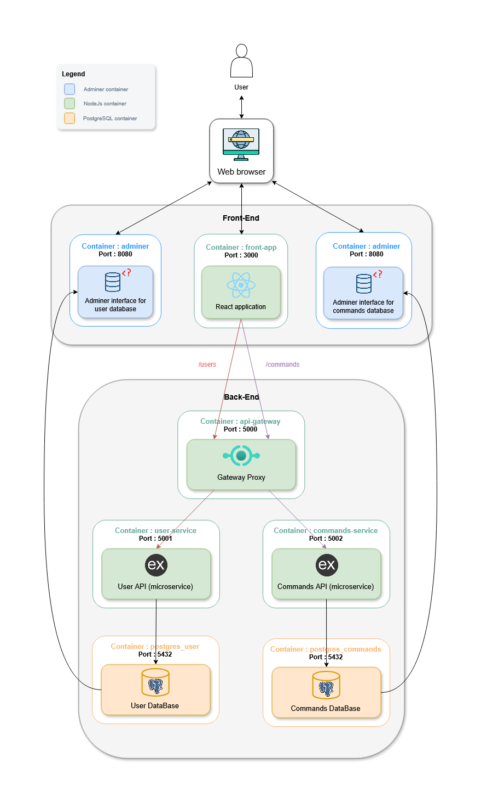

# Contexte du projet – Le Paradis des Cookies

Le Paradis des Cookies est une entreprise artisanale spécialisée dans la fabrication de cookies moelleux faits maison et personnalisables. Dans un marché où les grandes chaînes comme **La Mie Câline** ou **Paul** ainsi que les pâtisseries locales proposent des produits souvent standardisés ou peu personnalisables, l’objectif du projet est de se démarquer grâce à **l’originalité**, **la personnalisation** et **la fidélisation client**.

Le site web devient alors un élément important pour proposer une expérience moderne et accessible. Il met en avant un concept unique : offrir des cookies personnalisés mais aussi une expérience inédite grâce aux **pépites colorées** cachées dans certains cookies qui permettent d’obtenir des réductions.

# Fonctionnalité principale du projet

La fonctionnalité principale du site web est la **personnalisation complète des cookies et de leurs boîtes** directement en ligne.

Les utilisateurs peuvent :  
- Choisir un cookie artisanal
- Sélectionner des décorations ou des motifs personnalisés
- Personnaliser l’emballage avec un message ou un design
- Commander en ligne avec une livraison rapide grâce aux partenaires locaux

# Schéma d'architecture

# Répartition des services

Le projet est organisé en plusieurs blocs :

- **API Gateway** : Sert de point d’entrée pour toutes les requêtes externes. Elle redirige les requêtes vers les services appropriés et gère la sécurité, le routage et l’agrégation des réponses.
- **User Service** : Gère tout ce qui concerne les utilisateurs : création de compte, authentification... Il interagit directement avec la base de données des utilisateurs.
- **Commands Service** : Prend en charge la gestion des commandes : création, suivi, historique... Il est responsable des commandes des clients.
- **Front-app** : Application React qui gère l’interface utilisateur. Elle communique avec l’API Gateway pour toutes les opérations : authentification, gestion des commandes, personnalisation des cookies...

# Choix technologiques

- **Base de données** : Nous avons choisi PostgreSQL pour sa gestion avancée des types (UUID, citext) et sa compatibilité avec les architectures microservices
- **Accès aux données** : Nous avons utilisé le module natif `PG` de Node.js afin de garder un contrôle total sur nos requêtes SQL et sur la conception du schéma de base de données, sans les abstractions imposées par un ORM
- **Frontend** : Nous avons choisi React avec des bibliothèques modernes comme Chakra UI et TailwindCSS pour créer une interface moderne et facilement personnalisable.